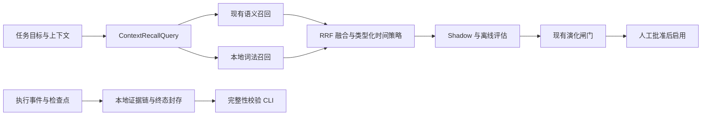

# RuVector 二次源码研究与 Gliding Horse 可采纳机制报告

**日期：** 2026-09-01  
**范围：** `PR-res/ruvector` 中能读取到源码的非集群模块，以及 Gliding Horse 当前 L0、Hyperspace、技能图、任务执行日志、快照、检索评估和受控学习闭环。  
**不在范围内：** 集群、Raft、复制、Delta 共识、Postgres 扩展、Hailo 集群与任何多机部署能力。

## 结论摘要

本轮没有发现应当直接移植的 RuVector 模块。参考树中有一部分 crate 只有局部源码或概念性说明，且缺少顶层 Cargo 工作区清单；因此不能把 README 中的能力宣称视为已被独立构建验证的生产能力。

但源码中有四类**实现模式**值得用 Gliding Horse 自己的领域模型和存储边界重新实现：

1. **优先修复现有召回查询契约。** 当前部分调度路径把随机 `task_iri` 当作向量检索文本，而任务目标、原始任务和 5W2H 信息已经在 `TaskContext` 中可用。这会使语义召回缺少实际语义，是已确认的 P0 问题。
2. **在 P0 后引入受控的词法—语义融合召回。** 代码代理需要精确命中 API 名、错误码、文件名和标识符；仅 dense 检索和标签加权不足以覆盖此类需求。应先以 shadow / 离线评估运行，再通过既有演化闸门决定是否启用。
3. **为任务执行证据增加可验证的封存链。** 现有执行日志已有版本化 L0 记录和内容摘要，但同一任务多个进程/实例时，序号分配和覆写防护没有形成原子追加语义。应以本地、单机事务为边界实现不可变证据帧与任务终态封存。
4. **新增真实 ANN 检索健康探针。** 不采用“相邻查询结果重合度”冒充 recall 的做法；以固定活跃样本的精确搜索作为基线，离线报告 ANN recall@K、延迟和重建建议。它只给出建议，不自动重写索引。

快照、时间衰减、通用过滤、图神经网络/卷积网络重排、随机跨域进化、形式化证明包装等参考实现没有带来足以超过现有 Gliding Horse 设计的收益，不建议采纳。

## 研究方法与判定标准

本报告以可读源码、依赖声明、测试以及失败路径为依据，而非仅依据模块说明。候选项至少满足以下条件才进入路线图：

- 能在单机、本地持久化和当前 Rust 架构中自然落位；
- 比现有模块补齐明确能力，而非建立平行记忆、图或快照系统；
- 有可定义的正确性、不变式、失败处理和回归测试；
- 能通过现有 `OfflineRetrievalEvaluator`、`EvolutionDeltaGate`、人工批准与 L0 证据链路受控上线；
- 不默认扩大原始 prompt、LLM 响应或工具参数的持久化范围。

所有建议均为**重新设计和原生实现**，不得复制参考代码、类型名、注释、模块命名或数据格式。

## 与现有能力的对照

| 领域 | Gliding Horse 已有基础 | 本轮发现 | 结论 |
| --- | --- | --- | --- |
| 快照与恢复 | Timeline 分块快照与变更日志；Hyperspace 有版本、校验和、临时文件、`fsync`、当前/上一代快照及 WAL 兼容恢复 | `ruvector-snapshot` 以整库 gzip 快照和旁路元数据为主，保存次序没有原子 manifest / 重命名保护 | 现有实现明显更成熟；不采纳 |
| 时间感知记忆 | Hyperspace 检索、核心 timeline、主动感知均已有时间衰减 | `ruvector-temporal-coherence` 是平面 O(n) 搜索与 O(n²) 连通图 PoC | 不采纳；修复查询内容后复用现有衰减 |
| 结构化筛选 | `HybridSearchFilter` 已支持 must/should/must-not、标签、重要性、类型、命名图和时间范围 | `ruvector-filter` 主要是内存谓词、文本空格分词和线性地理筛选 | 不采纳 |
| 图与技能知识 | 技能图已有 RRF 融合、结构检索与发现回退；timeline 有图快照 | 图压缩模块有“保留成员映射、medoid、脏区重建”的可借鉴模式 | 仅列为 P3 的只读上下文视图研究 |
| 自进化 | 任务族隔离、配对证据、最少样本数、模型/holdout 门控、健康冻结、人工批准 | `domain-expansion` 使用随机群体变异和近似采样 | 不采纳自动迁移；只保留远期受控先验迁移原则 |
| 召回质量 | HNSW、持久化元数据、删除、检查点、metadata vacuum、离线评估已有基础 | Delta/repair 模块的“recall”多为相邻查询重合度，不是 ground truth | 采用真正的 exact-vs-ANN 探针，不采用原算法 |

## 逐项源码核查

| 参考模块 | 源码实际情况 | 对 Gliding Horse 的启发 | 决策 |
| --- | --- | --- | --- |
| `ruvector-hybrid` | 内存 BM25 + dense + RRF；分词主要依赖空白，缺少持久化、事务、删除一致性与敏感信息边界 | 精确标识符与语义意图应并行召回，再可解释融合 | **采纳模式，P1** |
| `ruvector-proof-gate` | `HashChainGate` 会把前一摘要、序号和当前摘要链入 SHA-256；`MerkleGate` 的完整 inclusion proof 仍明确留给“production crate” | 任务证据应有前驱摘要、顺序和终态根 | **采纳模式，P1**；不用其代码或 Merkle 声称 |
| `ruvector-diskann` / `reuse` | 有以 held-out 样本比较精确与 ANN 结果、据此建议重建的思路 | 索引维护应基于真实 recall@K 与延迟，而非猜测 | **采纳模式，P2** |
| `ruvector-delta-index` / `hnsw-repair` | 增量、墓碑和修复概念存在；其 `estimate_recall` 比较相邻查询结果，不能代表召回率 | 需要观测与维护决策，不应将实验性拓扑修复直接接入 | 仅采纳诊断原则，**P2** |
| `ruvector-graph-condense` | 保留源成员、medoid、质心、覆盖率，按脏区增量重建视图 | 图上下文可派生为可追溯的只读视图，不能合并或删除源技能节点 | **P3 研究** |
| `ruvector-profiler` | p50/p95/p99 与配置摘要有价值；实现含手写摘要、Linux `/proc` 假设 | 将检索指标接入已有执行日志/离线评估即可 | 不新增 profiler 框架 |
| `ruvector-verified` | 虽声明依赖 `lean-agentic`，公开 `ProofEnvironment` 主要是本地符号表、递增 term ID 与缓存；参考树也缺少顶层工作区，无法独立复核完整证明链 | 类型不变量和显式失败可继续加强 | 不作为形式化验证能力采纳；仅保留不变量设计原则 |
| `ruvector-temporal-coherence` | 朴素余弦乘时间衰减，图构建为 O(n²)，维度异常以 `assert` 处理 | 当前时间衰减可继续使用，重点应放在正确的任务文本输入 | 不采纳 |
| `ruvector-snapshot` | 全量 gzip 快照、校验和、旁路元数据；无完整原子提交协议 | 现有代际快照/WAL 更可靠 | 不采纳 |
| `ruvector-filter` | 通用内存过滤；部分类型不匹配静默跳过 | 现有 JSON-LD 过滤器更适配 | 不采纳 |
| `ruvector-domain-expansion` | 随机变异、近似 Beta 采样及宽泛“跨域提升”目标 | 任何迁移都必须按任务族、源/目标 holdout 分别证明且默认不自动生效 | 不采纳；仅列 P3 原则 |
| `ruvector-coherence` / `attn-mincut` | 简化向量运算，长度以 `zip` 截断；attention/mincut 更像模型内部组件 | 外部 LLM 编排层不应伪造模型内部 attention 信号 | 不采纳 |
| `ruvector-gnn` / `gnn-rerank` / `cnn` | 需要稳定训练数据、特征语义和模型运维；不适合作为在线记忆排序捷径 | 现有离线图候选重排更可控 | 不采纳运行时神经网络 |
| `router-core` / `sparse-inference` | 实验性路由、推理与量化封装，和外部 LLM 网关职责不匹配 | 无 | 不采纳 |

明确排除：`ruvector-cluster`、`ruvector-raft`、`ruvector-replication`、`ruvector-delta-consensus`、`ruvector-postgres`、`ruvector-hailo-cluster` 及其依赖路径。这些均不符合当前无集群需求的边界。

## 已确认的 P0：检索查询内容错误

`src/core/sa/execution.rs` 经 `src/memory/scheduler.rs` 调用 `context_request_with_decay` 时，把 `TaskContext.task_iri` 传给 `HyperspaceStore::search_with_time_decay`。而 GlidingCode 生成的 `task_iri` 是 `iri://task/<uuid>` 形式的随机标识；同一 `TaskContext` 已持有 `objective`、`original_task`、5W2H、期望输出和成功标准。

因此，向量检索在这条路径中实际嵌入的是不表达任务语义的 IRI，而不是用户任务。这不是 RuVector 的缺陷，却是本轮对“混合检索是否有意义”进行映射时确认的现有集成缺口。先修复它，现有 dense 检索、时间衰减和后续词法融合才有可靠输入。

### P0 原生设计

新增显式的 `ContextRecallQuery` 值对象：

- `task_iri` 只用于审计、去重和范围关联，绝不作为默认嵌入文本；
- `semantic_text` 由受长度限制的 `objective`、`original_task` 与必要的 5W2H 字段组成；
- 期望输出和成功标准作为可配置补充，缺失时安全降级；
- 统一进行 Unicode 规范化、空值处理与长度限制；
- 检索响应保留 `query_version`、字段来源和候选原因，便于离线复盘，但不将原始敏感内容复制进普通日志。

验收测试：随机 IRI 改变时同一语义请求的候选稳定；任务语义改变时嵌入输入改变；空字段、超长字段、Unicode 和脱敏路径安全；调度、SA 执行和 CLI 调用点均不再把裸 `task_iri` 作为检索查询。

## 推荐实施路线

### P1-A：本地词法—语义融合召回

**确认。** `HybridSearchFilter` 中的“hybrid”是语义召回加标签助推，并非可精确命中标识符的倒排检索；技能图已有 RRF，但记忆召回路径没有同等的 lexical+dense 融合。

**设计。** 在 P0 的 `ContextRecallQuery` 基础上，为明确允许进入可检索记忆的记录维护版本化本地倒排索引。规范化应处理 NFKC、snake_case、kebab-case、camelCase、路径、错误码和中英文混合文本；不能只按空格拆词。插入、更新和删除必须按内容摘要与 L0 记录事务一致，避免陈旧 posting。先应用硬过滤，再取 dense 与 lexical 各自候选集，以确定性的 RRF（例如 `k0=60`）融合；时间衰减按记录类别在融合后执行，永久审计证据不被误衰减。

**开发边界。** 默认只索引白名单记录类别及已脱敏的可检索字段；禁止把完整 prompt、LLM 原始响应、工具实参或执行遥测全量写入该索引。初始状态仅 shadow：记录候选差异和摘要，不改变实际返回。

**测试与准入。** 覆盖 Unicode/代码标识符、索引重建中断、upsert/delete 无陈旧 posting、过滤不逃逸、RRF 顺序确定性、敏感字段不入库。以带标签的检索集比较 baseline/candidate 的 NDCG、MRR、recall@K、p50/p95 延迟和无结果率；只有满足既有 `OfflineRetrievalEvaluator` 与 `EvolutionDeltaGate` 的非回归门槛并经人工批准，才启用。

### P1-B：任务证据链与终态封存

**确认。** `TaskExecutionJournal` 通过 L0 持久化事件并维护本地 `AtomicU64` 序号，具备可追踪性；但两个 journal 实例恢复同一任务时可从同一最大序号继续，且当前 L0 写入语义允许合并/覆盖。它不足以提供“不可重排、不可静默覆写”的任务级证据链。

**设计。** 原生实现 `TaskEvidenceLedger`，由 L0 的单机事务支持原子 append：每帧包含任务/attempt 标识摘要、递增序号、前帧摘要、事件内容摘要、时间、模式版本和关联 evidence IRI。任务结束时写入只追加的 seal，记录帧数、链根、终态和已有检查点/评估/批准证据的 IRI。提供 `verify-task-evidence`，检查版本、序号连续性、前驱关系、内容摘要、seal 和引用存在性。

**安全边界。** 该机制用于检测意外覆写、遗漏和重排，不应宣称可抵抗拥有底层存储写权限的攻击者。若未来需要对抗性不可抵赖，必须另行设计外部签名密钥、可信时间源和密钥轮换；本阶段不引入。

**测试与准入。** 并发 append、重复序号拒绝、进程重启续写、缺帧/改帧/重排/删除检测、终态 seal 约束、默认不捕获原始敏感 payload，以及故障注入后的原子性。性能基线应独立记录 p50/p95 append 与 verify 时间。

### P2：ANN 检索健康探针与维护建议

**确认。** 当前 Hyperspace 可删除、检查点和 metadata vacuum，但 `vacuum` 不等价于 HNSW 全拓扑重建。RuVector 的“结果重合度 recall”不能作为真实质量信号；其 held-out exact-vs-ANN 的思路值得原生化。

**设计。** 固定随机种子，从活跃记录中稳定抽样；同一过滤条件下对每个样本分别执行精确扫描和 ANN，计算 recall@K、候选短缺率、p50/p95 延迟、活跃/已分配/删除指标。输出版本化本地诊断报告与建议：`healthy`、`checkpoint_recommended`、`metadata_vacuum_recommended` 或 `reindex_required`。没有经过运维审阅和恢复验证，不自动修改索引结构。

**测试与准入。** 已知小集合上的精确 recall、过滤一致性、确定性样本、空/小索引、删除后样本有效性、指标边界和报告兼容性。只有建立受控基准和重建/恢复流程后，才允许新增实际 reindex 操作。

### P3：仅研究，不进入当前实现

1. **只读技能图上下文视图。** 当提示上下文候选量持续超预算时，基于一个明确的 timeline snapshot 派生 `SkillContextView`：包含成员 IRI、medoid、摘要证据 IRI、覆盖率和源摘要。视图不能修改、合并或删除源技能节点，必须能完整回溯。
2. **兼容任务族的受控先验迁移。** 仅在显式定义的兼容任务族之间，携带衰减后的策略先验；源域与目标域分别需要受控 holdout 非回归，且默认不自动生效。不得迁移原始轨迹、prompt 或工具调用内容。

## 实施顺序与停止条件

| 顺序 | 项目 | 可开始条件 | 停止/回滚条件 |
| --- | --- | --- | --- |
| 1 | P0 查询契约修复 | 增加调用点覆盖测试 | 召回评估回归、敏感字段处理不清楚 |
| 2 | P1-A 融合召回（shadow） | P0 稳定；定义索引字段白名单 | 离线指标不达标、延迟超预算、出现数据泄露风险 |
| 3 | P1-B 证据链 | 定义 L0 原子追加 API 与迁移/故障语义 | 不能保证原子 append 或恢复一致性 |
| 4 | P2 健康探针 | 建立可重复的小型精确基准 | 样本不稳定、过滤比较不等价 |
| 5 | P3 研究 | 有上下文预算或跨任务族收益的真实证据 | 无证据、覆盖率下降或可追溯性变差 |

## 最终建议

建议下一阶段只实施 P0、P1-A 和 P1-B，并严格执行“确认 → 设计 → 开发 → 测试 → shadow/离线评估 → 人工批准”的顺序。P2 在具备真实索引规模和稳定基准后实施；P3 保持研究状态。

这条路线的核心不是扩张模块数量，而是让已有的记忆、检索、执行证据和受控学习闭环使用正确输入、产生可测输出并留下可验证证据。它符合单机边界，也不会在源码中引入 RuVector 痕迹。
